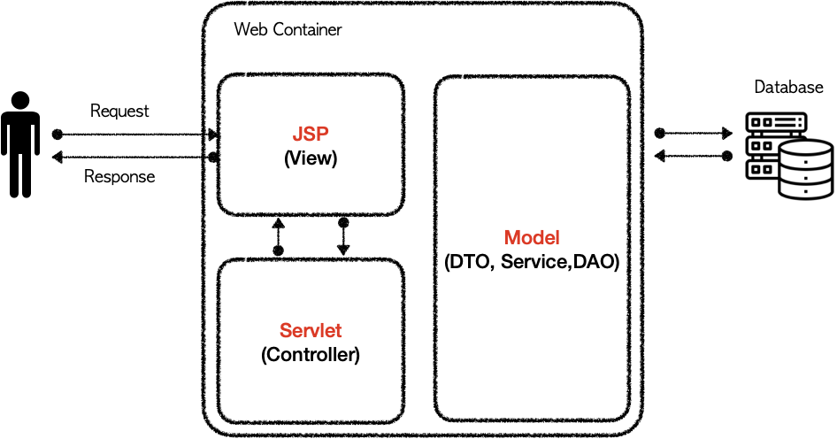

# MVC 구조 만들기

##Intro 🙋‍♂️
Servlet의 단점을 보완하고 JSP를 더욱 효율적으로 사용하기 위해
MVC구조를 사용해보려 해요 !<br/> 기존 Servlet의 비효율적인 코드를 간소화 하기 위하여
JSP를 함께 사용했는데 <br/>
JSP 내에서 Business Logic과 HTML을 한번에 다루는 것도
비효율적인 생각이 들어 구조를 바꿔볼까 합니다 !

## MVC가 뭐야 ? 🤔
MVC는 Model, View, Controller 3가지 영역으로 나누어 처리하는 것을 말해요.
소프트웨어 디자인패턴의 한 종류죠 😎
- Model : Business Logic
- View : Web page
- Controller : 입력처리, 흐름제어 담당

이렇게 3가지 기능을 나누어 처리하고 있는데,<br/>
여기서 JSP는 View에, Servlet은 Controller에, Dto와 DAO같은 로직처리 클래스가 Model에 해당돼요.


[](https://velog.io/@junhok82/Servlet%EA%B3%BC-JSP%EB%A1%9C-%EC%95%8C%EC%95%84%EB%B3%B4%EB%8A%94-MVC-%ED%8C%A8%ED%84%B4)

## MVC 구조로 변경하기 ✍

Servlet과 JSP를 MVC 구조로 변경하려면 데이터를 함께 사용해야 해요.
필요한 데이터들을 공유하기 위해 제공되는 기능이 두가지가 있어요 !

- Forward
- Redirect

### Forward
Forward는 url을 유지할 수 있고 한번의 요청에서 처리하기 때문에 데이터를 공유할 수 있어요 !

```java
public void service(HttpServletRequest request, HttpServletResponse response)
    throws ServletException, IOException {
    
    // jsp에 데이터를 공유하기 위해 속성에 값을 추가해요
    request.setAttribute("이름", 객체);     
        
    RequestDispatcher rd = request.getRequestDispatcher("jsp 위치");    
    rd.forward(request, response);
}
```

request.setAttribute로 설정한 값은 jsp에서 공유된 데이터를 통해 접근할 수 있어요.
```java
<% 
    객체이름 변수 = (객체)request.getAttribute("이름");
%>
```

### Redirect
Redirect는 Forward와 다르게 url 요청을 받으면 Client에게 302코드를 응답하고 location에 입력한 url을 보내줍니다.<br/>
그럼 Client는 302를 받고 해당 location으로 다시 응답을 보내는 방식이에요.

쉽게 말하자면 url 창을 다시 연다고 생각하면 편해요 !
```java
public void service(HttpServletRequest request, HttpServletResponse response)
    throws ServletException, IOException {
        
    response.sendRedirect("url");
    }
```
jsp에서 데이터 로직 처리후 페이지 이동이 필요한 부분에 사용 될 수 있어요.
예를 들어 수정기능을 사용하게 되면

### Servlet/JSP 활용
doGet, doPost를 이용하면 한 기능에서 페이지 이동 부분, 데이터 수정부분은 
한 클래스 안에서 처리할 수도 있습니다 !

```java
@WebServlet("url")
public class ModifyServlet extends HttpServlet {
    public void doGet(HttpServletRequest request, HttpServletResponse response)
        throws ServletException, IOException{
        request.setAttribute("board", board);
        // 페이지 이동
        RequestDispatcher rd = request.getRequestDispatcher("/mvcboard/modify.jsp");
        rd.forward(request, response);
    }
    public void doPost(HttpServletRequest request, HttpServletResponse response)
        throws ServletException, IOException{
   
        // 페이지 이동
        response.sendRedirect("url");
    }
}
```


### 주의사항
URL 설정 시 프로젝트명을 명시하지 않아도 되는 경우
- web.xml 파일 내에서
- @WebServlet 어노테이션 내의 경로 설정
- Forward 사용할 때